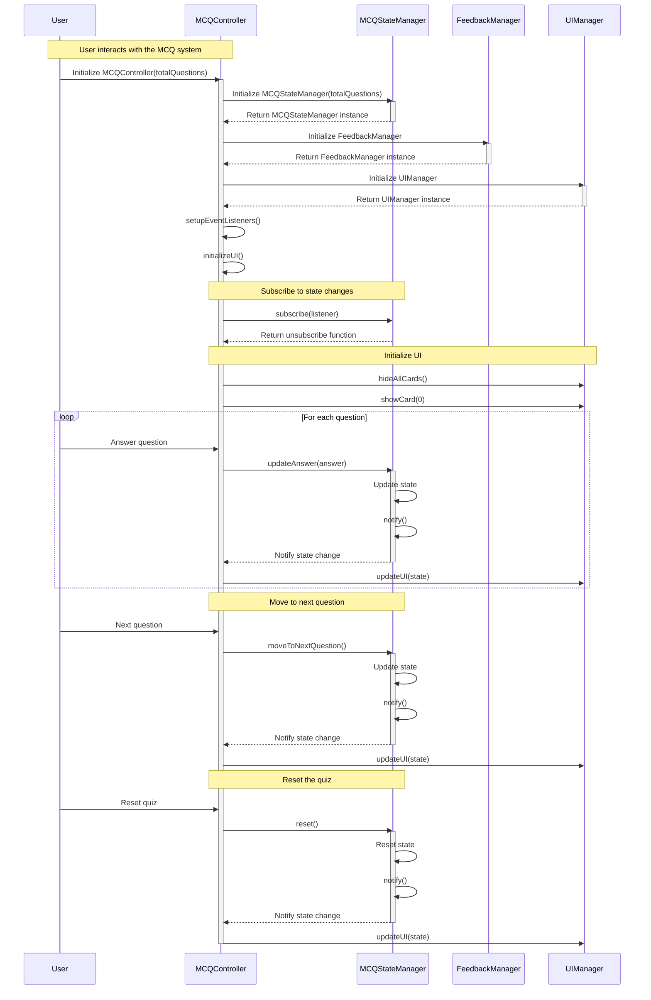

# MCQ Module Implementation Flow

## 1. User Integration & Initialization

### Shortcode Reference

When a user adds this to their markdown:

```markdown

```

The flow begins:

1. Hugo processes shortcode in `layouts/shortcodes/agsayyed/mcq.html`
2. Shortcode calls partial template `layouts/partials/agsayyed/mcq.html`
3. YAML data is loaded from `data/qa/mcq.yml`

### HTML Template Processing

The `mcq.html` partial:

1. Reads YAML data structure
2. Generates HTML scaffold:
   - Accordion container
   - Question cards (initially hidden)
   - Progress bar
   - Navigation buttons
   - Score display

### Accordion Container Structure

- A Quiz contains questions and questions has options and answers.
- To display the questions and answers in a collapsible format, an accordion container is used.
- It is built using Bootstrap classes (accordion, accordion-item, accordion-header etc.).
- Collapsible sections toggle visibility of MCQs and  other content. When ti comes to implementing we say that the container would have a `progress bar`, `MCQ cards`, `navigation buttons`, `score and summary`.

- Progress Bar:
  Displays the user's progress in answering questions.
  Dynamically updates as questions are attempted.

- MCQ Cards:Each question is displayed within a hidden card (style="display: none;"). Question text and options are rendered dynamically using Go templates ({{ $item.question }}, {{ $item.options }}). Includes feedback for correct/incorrect answers via a "feedback-box."
- Navigation Buttons:
   Next: Progresses to the next question.
   Start Over: Restarts the quiz (initially hidden).

- Score and Summary:
  Displays the number of attempted questions out of the total.
  A summary container for additional details or results.
  Go Template Integration:

The questions and answers are dynamically populated from the `mcqData` Go variable using loops and conditional logic. Supports multiple options per question using slices or single values.

- Dynamic Behaviors
  User Interaction: Users answer questions by selecting an option from the list.
  Feedback is displayed, explaining the correct answer.

- Progress Tracking:
  Progress bar updates based on aria-valuenow and style="width: X%;".

- Dynamic Rendering:
  MCQ cards are initially hidden and displayed sequentially as users navigate.
  Template Flexibility:
  Go template expressions allow for seamless integration with backend data.

#### How it was implemented

- Outer Div

<div id="mcq-container">

- Purpose: Acts as a container for all MCQ cards.
- Dynamic Data: The container's content is populated dynamically using Hugo's templating syntax `({{ ... }})` and iterates over the `mcqData` array.
  
- Loop Through MCQs `{{- range $index, $item := $mcqData }}`

Purpose: Iterates through each item in `mcqData`. Each `$item` represents one MCQ.

Hugo Templating:

- `$index`: The index of the current MCQ.
- `$item` : The current MCQ object containing properties like question, options, and answer.

---

## 2. Architecture & Design Patterns

### Model-View-Controller (MVC)

1. **MVC Pattern**
   - Model: MCQState (state management)
   - View: HTML template + UIManager
   - Controller: MCQController

2. **Observer Pattern**
   - Subject: MCQStateManager
   - Observers: MCQController, UIManager
   - Event flow: State changes → Notify observers → UI updates

3. **Dependency Injection**
   - Components injected into MCQController
   - Loose coupling between components

### Component Structure

```bash
js/
├── components
│   └── FeedbackManager.ts  # Manages feedback display logic
├── config
│   └── mcq.config.ts       # Configuration options for the MCQ module
├── index.ts                # Entry point for the module
├── initialise.ts           # Initialization logic for the MCQ module
├── managers
│   └── UIManager.ts        # Handles UI operations and updates
├── mcq
│   ├── MCQController.ts    # Main controller for the MCQ module
│   ├── MCQState.ts         # State management for the MCQ module
│   └── sounds              # Directory for sound files
├── models
│   └── Question.ts         # Model implementation for questions
├── types
│   └── mcq.types.ts        # Type definitions for the MCQ module
└── utils
   └── logger.ts           # Utility for logging
```

### How Hugo HbStack Site Process Custom Scripts and Styles

- `index.ts` file in `hb/modules/vendor` laods scripts and styles for the MCQ module.

```typescript
log.separator('index.ts: starting importing modules one by one')
import './types/mcq.types';
import './config/mcq.config';
import './components/FeedbackManager';
import './mcq/MCQState';
import './mcq/MCQController';
import log from './utils/logger';
import './mcqMain.ts';

log.debug('/types/mcq.types loaded\n'
  + '/config/mcq.config loaded\n'
  + '/components/FeedbackManager loaded\n'
  + '/mcq/MCQState loaded\n'
  + '/mcq/MCQController loaded\n'
  + '/mcqMain.ts loaded\n');

log.separator('index.ts: Finish Module importing');
```

> Note: `logger` is used to get the debugging information in the console. It is installed as dev dependency and , it is also extended to create a new `separator` function, it is shown here. The last file loaded is `./mcqmMain.ts`. This is the file where initialsaion of the MCQ module is done. Conventionaly its name is kept `main.ts` but Hugo HbStie does not accept as it conflicts with probably existing `main.ts`.

```typescript
import log from 'loglevel';

interface ExtendedLogger extends log.RootLogger {
  separator: (message: string) => void;
}

const extendedLog: ExtendedLogger = log as ExtendedLogger;

// Set the logging level based on the environment
if (process.env.NODE_ENV === 'production') {
  log.setLevel('warn');
} else {
  log.setLevel('debug');
}

// Add a method to log a separator line
extendedLog.separator = (message: string) => {
  log.debug(`\n--- ${message} ---\n`);
};

export default extendedLog;
```

## 3. Initialization Flow

- Page Loads, initiliasing MCQ module

```typescript
import { MCQController } from './mcq/MCQController';
import log from './utils/logger';  // Import the logger

// Initialize when DOM is ready
document.addEventListener('DOMContentLoaded', () => {
  if (document.querySelector('.mcq-card')) {
    log.separator('mcqMain.ts: Initializing MCQ Controller');  // Use separator method
    const totalQuestions = document.querySelectorAll('.mcq-card').length;
    new MCQController(totalQuestions);  // Initialize MCQController without using an identifier
  }
});
```

- In turns MCQController Initialises itself

```typescript
   constructor() {
     this.stateManager = new MCQStateManager(totalQuestions);
     this.uiManager = new UIManager();
     this.setupEventListeners();
     this.initializeUI();
   }
```

### Observer Pattern

```typescript
// StateManager notifies subscribers of state changes
private listeners: ((state: MCQState) => void)[] = [];

public subscribe(listener: (state: MCQState) => void) {
    this.listeners.push(listener);
}

private notify() {
    this.listeners.forEach(listener => listener(this.state));
}
```

### Dependency Injection

```typescript
class MCQController {
    constructor() {
        this.stateManager = new MCQStateManager(totalQuestions);
        this.feedbackManager = new FeedbackManager();
        this.uiManager = new UIManager();
    }
}
```

### State Flow Example

- User selects answer:

```txt
   Click → Controller.handleAnswer → StateManager.updateAnswer → notify observers
```

- Next question:

```txt
   Click → Controller.handleNext → StateManager.moveNext → notify observers
```

## 5. Component Communication

### Event Flow

1. **User Interaction**
   - Click events handled by Controller
   - Controller updates State
   - State notifies observers

2. **UI Updates**
   - Controller receives state changes
   - Delegates to UIManager
   - UIManager updates DOM

### State Updates

1. Answer Selection:

   ```
   User clicks → handleAnswer → updateState → notify → updateUI
   ```

2. Navigation:

   ```
   Next button → handleNext → moveToNext → notify → updateUI
   ```

## 6. Key Features

1. **State Management**
   - Centralized state
   - Observable pattern for updates
   - Immutable state updates

2. **UI Management**
   - Abstracted DOM operations
   - Consistent UI updates
   - Progressive feedback

3. **Event Handling**
   - Delegated events
   - Debounced operations
   - Clean event listeners

## 7. Configuration

MCQConfig allows customization:

```typescript
{
    showInstantFeedback: boolean;
    shuffleQuestions: boolean;
    showProgressBar: boolean;
}
```

## 8. Implementation Notes

1. **State Immutability**
   - State updates create new state
   - Prevents side effects
   - Predictable updates

2. **Event Delegation**
   - Efficient event handling
   - Memory optimization
   - Better performance

3. **Error Handling**
   - Graceful degradation
   - User feedback
   - State recovery

## 9. Future Improvements

1. **Potential Enhancements**
   - Question shuffling
   - Timer support
   - Score persistence
   - Analytics integration

2. **Performance Optimizations**
   - Virtual DOM-like updates
   - Lazy loading
   - State caching

## 3. File Structure & Responsibilities

### Types (`types/mcq.types.ts`)

- Defines interfaces for Questions, Answers, State

### Sequence Diagram


